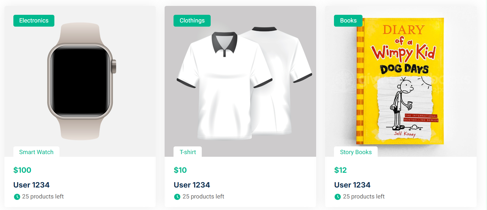
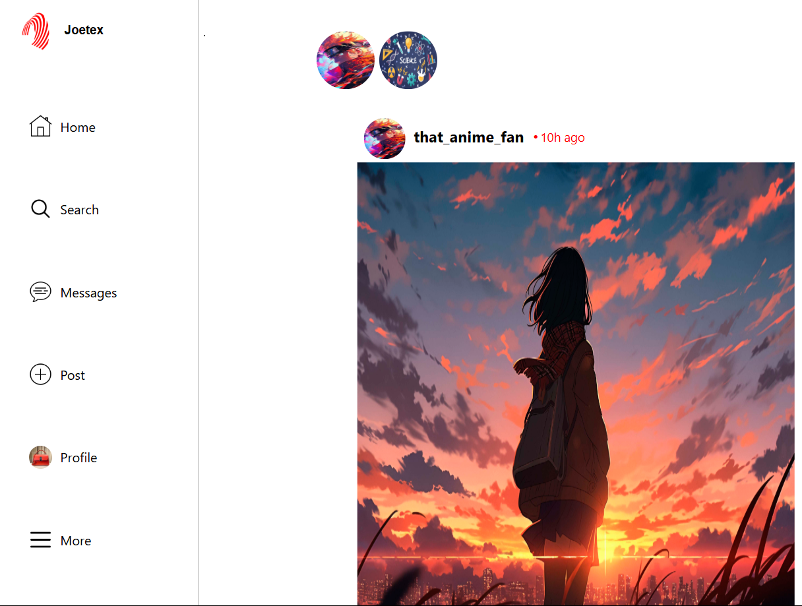

 <h2>Hi there, I'm Joseph Edward 👋</h2>

  

    
    
    
    
  

  
I'm a <strong>Software Developer</strong> and <strong>Mechatronics Engineering Student</strong> passionate about building practical software solutions that solve real-world problems.

  
From Android applications to full-stack web platforms, I enjoy creating clean, scalable, and user-focused products while continuously learning new technologies.

  

 <h2>🌐 Connect With Me</h2>
  
Feel free to reach out if you'd like to collaborate, discuss ideas, or work on interesting projects.

  
  

   
    
    
  

  

  <h2>🛠️ Tech Stack &amp; Tools</h2>

  <table>
    <thead>
      <tr>
        <th>Category</th>
        <th>Skills &amp; Technologies</th>
      </tr>
    </thead>
    <tbody>
      <tr>
        <td><strong>Frontend</strong></td>
        <td>
          
          
          
          
        </td>
      </tr>
      <tr>
        <td><strong>Backend</strong></td>
        <td>
          
          
        </td>
      </tr>
      <tr>
        <td><strong>Database &amp; Cloud</strong></td>
        <td>
          
          
        </td>
      </tr>
      <tr>
        <td><strong>Mobile</strong></td>
        <td>
          
          
        </td>
      </tr>
      <tr>
        <td><strong>Languages</strong></td>
        <td>
          
          
          
          
        </td>
      </tr>
      <tr>
        <td><strong>Tools</strong></td>
        <td>
          
          
          
          
        </td>
      </tr>
    </tbody>
  </table>

  

  <h2>Featured Projects</h2>

  <h3>JoNotify</h3>

  
An Android application that gives users control over which WhatsApp group chats they want to receive messages from, and who in those groups the messages should come from. Users can select specific groups and choose particular members in each group whose messages should come from.

 
  
🌐 <strong>Live Demo:</strong> <a href="https://jonotify.netlify.app">https://jonotify.netlify.app</a>

  

<h3>NibaMart</h3>

  
An online marketplace connecting buyers and sellers, allowing vendors to list products and customers to discover items from multiple stores.

   
  
🌐 <strong>Live Demo:</strong> <a href="https://impressive-sondra-joetex-c08d12f0.koyeb.app">https://impressive-sondra-joetex-c08d12f0.koyeb.app</a>

  

  <h3>Joetex</h3>

  
A full-stack social platform where users can create posts, interact with others, send private messages, and manage personalized profiles.

 
  
🌐 <strong>Live Demo:</strong> <a href="https://joetex.onrender.com">https://joetex.onrender.com</a>

  

  <h2>📚 Currently Learning</h2>

  <ul>
    <li>Machine Learning</li>
    <li>Artificial Intelligence</li>
    <li>Large Language Models (LLMs)</li>
    <li>Advanced Android Development</li>
    <li>Scalable Backend Architecture</li>
  </ul>

  

  <h2>🎯 Goals</h2>

  <ul>
    <li>Build impactful software products</li>
    <li>Contribute to open-source projects</li>
    <li>Grow as a software engineer</li>
    <li>Collaborate with developers worldwide</li>
  </ul>
